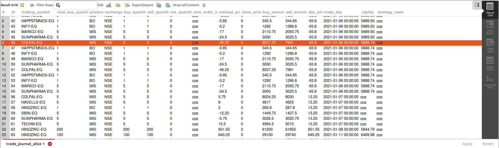

# Algo trades journal logger
This code utility should help you in logging your daily algo trades done.

> Currently built for Aliceblue you could tweek your code accordingly to make work with other broker apis

Remember i'm using here SQLLite3 db as well here.even you can tweek your script to use sqllite3 db only instead of mysql.

#### Before you get started

- <strong>Step 1 : </strong> Configure the **env_credential.json** file in credentials folder
  - This utility is configured here for Aliceblue, telegram and  your mysql database dependencies. Tweek code as needed.
- <strong>Step 2 :</strong> Create the table for logging using the create table script placed in **db_setups/create_journaltable.sql**
- <strong> Step 3 :</strong> Install the dependencies by running **pip install requirements.txt**

#### Atuomate it
You could also schedule the logging to be automatic to running only on weekdays.

Below expression would run daily at 3.30PM from Mon-Fri.
If you're running Linux/Ubuntu Machine you schedule it using crontab expression. crontab expression could be as bin below sample

<code>30 15 * * 1-5 /home/path-to-python-env/python  /path-to-file/algo-trades-logger/tradelogger.py</code>

#### How to Run
Choose your environement where you've dependencies installed and then run below command.
<code>python tradelogger.py</code>

